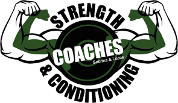

# S&C Coaches

Website for S&C Coaches to help attract new members and to offer current members access to booking classes and times of classes for their personal training business.
[S&C](https://brimurphy.github.io/sccoaches/)

_Educational purposes only._

## Motivation

My goal for the website was to make a inviting website which shows the warmth and friendliness of the coaches. I wanted a clean and attractive layout that was easy to navigate. Current clients don't even realise they have a website and they use different Apps for their clients to _book classes, pay memberships and to send personalised workouts_. My goal will be to have all needs met with the one website, eventually with a members area which would be accessable by members

# UX

## Who is this website aimed at?

The website is directed towards exsisting clients and potential new clients, giving them access to booking classes, changing their membership plans and seeing what else is provided by the coaches.

## Features

When you access the website you will be greeted with a photo of current members and the two coaches **Sabrina and Lukazs**. With kids in the image to show they can accomodate families that can't leave the kids at home.

> The Navbar has been designed with the colors of the logo and vests on the ladies in mind.
>
> The Footer has links to their social media pages and a google maps link to help locating the gym. It also contains a small navagation menu made with some icons.
>
> The Navbar and Footer are replicated on each page.

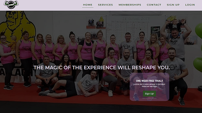 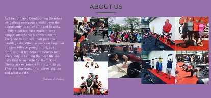

The main job of the home page is to show everybody is welcome, from beginners to the more advanced client. A free week trial offers a no strings attached deal so new clients can try the classes before any financal commitment is made.
With the next section giving an introduction into who S&C Coaches are followed by a small comment from each coach.
The final bit of the homepage is a client review section with reviews from current clients.

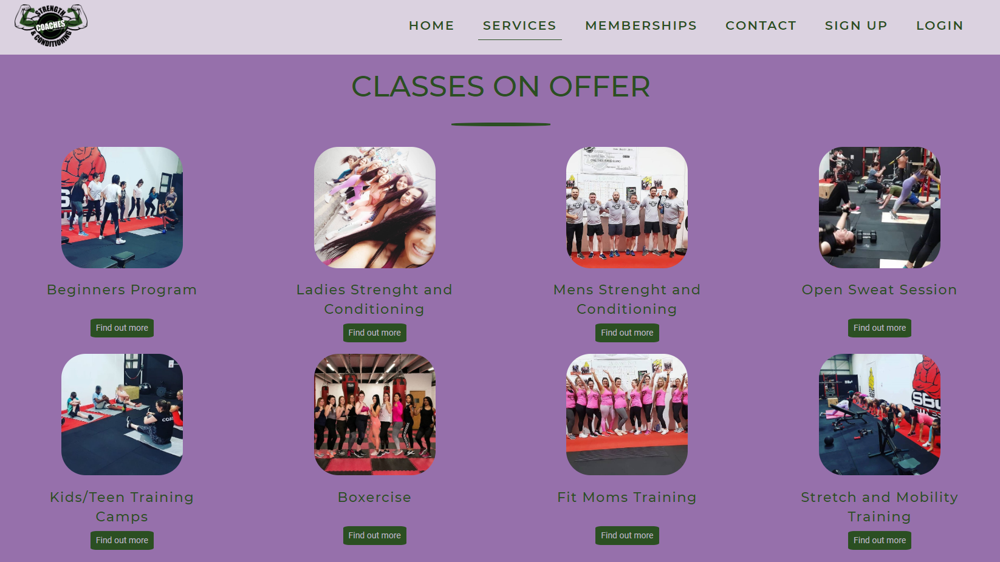

The services page gives an overview of what the team has to offer. Both in and outside of the gym.
In the classes section each class has a drop down box for potential new clients to get an overview of what they can expect from the different classes.
The outside the gym section focus on what they do away from the weights and exercise machines. They are all focused on showing that **they care about their clients and not just their appearence.**

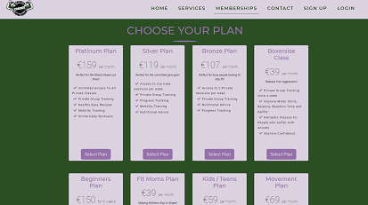

This is the business page were clients and potental clients can select a plan that suits them the most.
I also plan to add a section for preseason bootcamps for sports clubs and summer bootcamps.

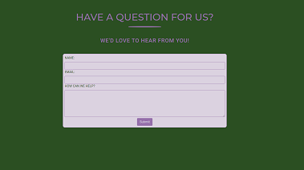

I've gone for a simple contact form which members and non members can use to contact the coaches about any query or question they might have.

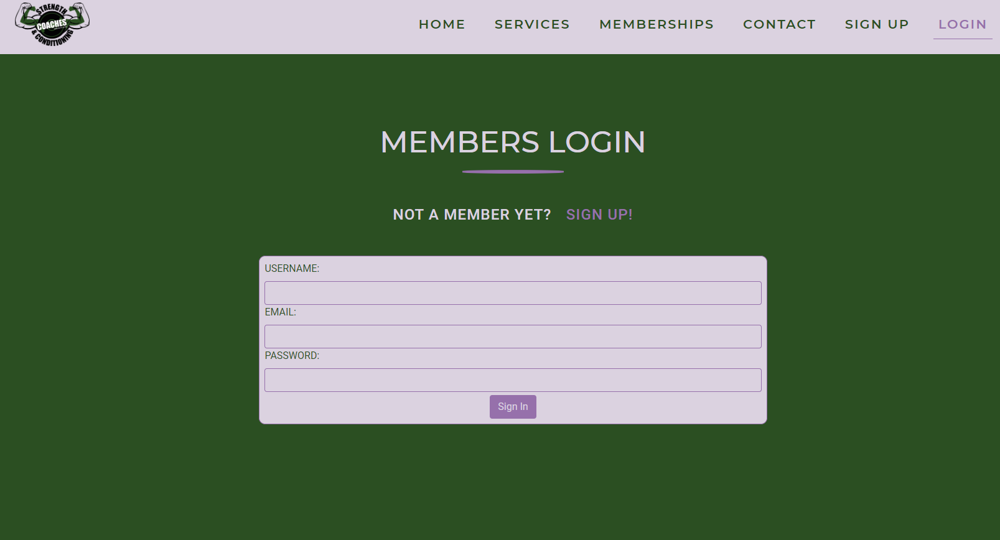 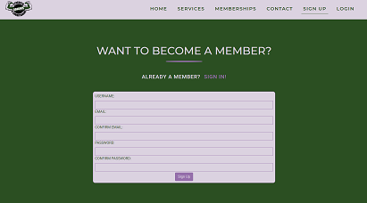

These pages will allow new clients join the members area of the website and members to access the members area of the website.

### Future Features

1. Members page where you can book into classes.
2. Members area where you can upload progress pictures.
3. Members area where you can recieve daily workouts as requested by client.
4. Team preseason Bootcamps.
5. Deals on seasonal Bootcamps.

## User Stories

- As a user I want to find out more information about the coaches.
- As a user I want to easily navigate through the website.
- As a user I want to contact the coaches if I have any inquiries.
- As a user I want to find out what classes are available.
- As a user I want to become a member.

## Wireframes

I used Balsamiq Wireframes to create the wireframes for Desktop and mobile.
In production of wire frames I decided to create an alternative layout of the home and services pages
to see if fit better. I upgraded these alternatives to the offical versions on review.

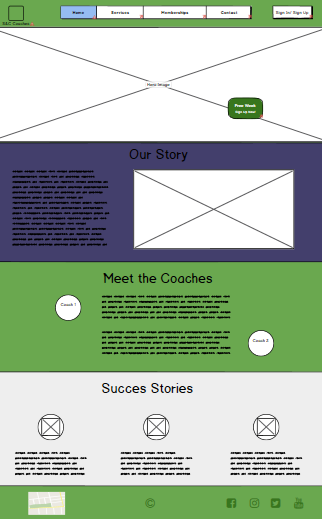 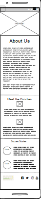
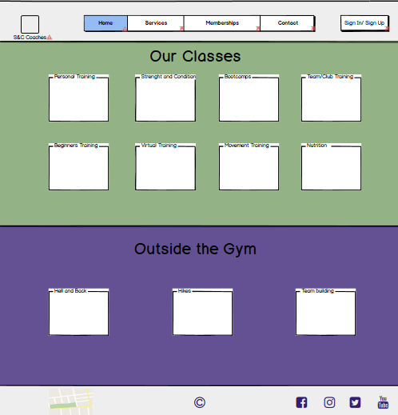 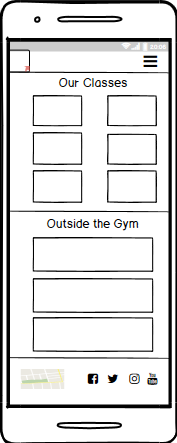
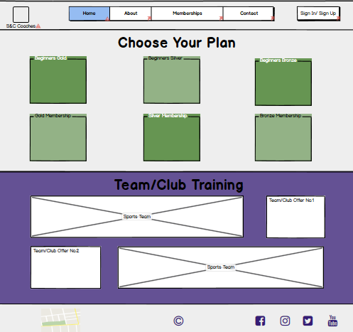 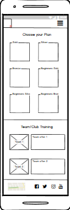
 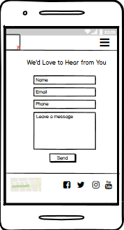
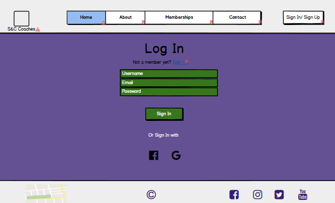 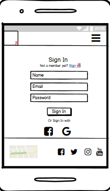
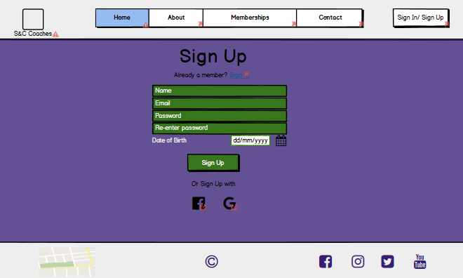 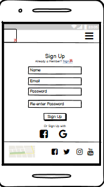

## Technologies Used

- [HTML5](https://en.wikipedia.org/wiki/HTML5)

  - used for the structure of the website.

- [CSS3](https://en.wikipedia.org/wiki/Cascading_Style_Sheets)

  - used to style the website.

- [GitHub](https://github.com)

  - used to create repository and to host the repository.
  - used for version control.

- [Gitpod](https://www.gitpod.io/)

  - used as my IDE to develop the project

- [Bootstrap](https://getbootstrap.com/)

  - Bootstrap Framework used mainly:

    - Create responsive layout and design.
    - For navbar and toggler in screens sized 991px and smaller.
    - To center text.
    - On the buttons

- [Google Fonts](https://fonts.google.com/)

  - Fonts used

    1. Montserrat - For nav and headings
    2. Roboto - For large text quotes
    3. Dancing Script - On names

- [Font Awesome](https://fontawesome.com/)

  - All Icons were taken from the Font Awesome database.

## Test Scenarios

- Test: Navbar on all screen sizes goes to correct location

  1. Go to the [S&C Coaches](https://brimurphy.github.io/sccoaches/) website on desktop.
  2. Press each Nav link to confirm they go to correct destination.
  3. On each page check all links are working and logo returns to home.
  4. Repeat process on all screen sizes.

- Test: One week trial sign up brings you to sign up page.

  1. Go to the [S&C Coaches](https://brimurphy.github.io/sccoaches/) website on desktop.
  2. Click sign up button on offer.
  3. You are brought to Sign Up page.
  4. Repeat process on all screen widths of 576px and above.
  5. Check offer doesn't appear on mobile view.

- Test: Ensure all forms require email address and name

  1. Go to the [S&C Coaches](https://brimurphy.github.io/sccoaches/) website on desktop.
  2. Go to contact page.
  3. Fill in form with empty name field, warning message should appear.
  4. Fill in form with empty email field, warning message should appear.
  5. Fill in form with empty message field, warning message should appear.
  6. Repeat steps on mobile and tablet views.

- HTML5 checked on each page by:

  - [W3C HTML Validator](https://validator.w3.org/)

- CSS3 checked by:
  - [W3C CSS Validator](https://jigsaw.w3.org/css-validator/)

## Acknowledgements

- First and foremost I want to thank my partner for her support and understanding as I've worked on my project, and for her feedback on it.

- My Mentor Jonathan Munz, my mentor for his wisdom, advice and reference material.

- [Sabrina and Lukazs](https://www.sccoaches.com/) for allowing me to base this project around them.

- [Code Institue](https://codeinstitute.net/) for the opportunity to change my career

### Content

- Written Content:

  - Hero Image quote copied from [Gym Qoutes](http://www.gymquotes.co/gym-life/the-magic-of-the-experience-will-reshape-you/#:~:text=Once%20you%20being%20your%20fitness,physical%20aspects%20of%20working%20out.)
  - About Section text copied from [S&C Coaches](https://www.sccoaches.com/)
  - Coach Quotes copied from an article by [The Irish Times](https://www.irishtimes.com/life-and-style/health-family/fitness/13-things-top-personal-trainers-wish-you-knew-1.2727472) about personal trainers.
  - Testimonials taken from Google reviews of [S&C Coaches](https://www.sccoaches.com/)
  - Memberships details have been copied from [S&C Coaches](https://www.sccoaches.com/) and the developer.
  - Stretch and Mobility Training text copied from [Trust My Coach](https://trustmycoach.com/functional-training/8-benefits-functional-training/) article on _8 HEALTH BENEFITS OF FUNCTIONAL TRAINING_

- Media / Images:

  - Majority of Images have been supplied by, with permission, [S&C Coaches](https://www.sccoaches.com/) from their various social pages.
  - Testimonial Images from [Pexels.com](https://www.pexels.com/)
    - Reviewer 1 from [Christina Morillo](https://www.pexels.com/photo/woman-smiling-at-the-camera-1181686/).
    - Reviewer 2 from [Daria Shevtsova](https://www.pexels.com/photo/man-leaning-on-yellow-painted-wall-1548164/).
    - Reviewer 3 from [Hannah Nelson](https://www.pexels.com/photo/close-up-photography-of-a-woman-near-wall-1065084/).
  - Health and Wellness Image from [Dedibox News](https://www.dedibox-news.com/health-and-wellness-services-and-products-for-a-balanced-life-style/).

## License & Copyright

© Brian Murphy and S&C Coaches
